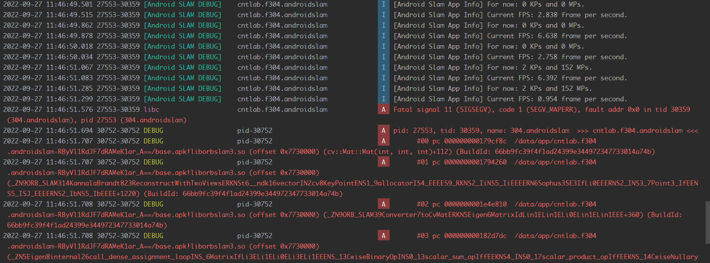

# AndroidSlam
SLAM system on Android.

# 日志
## 2022/09/27
### 1. 项目结构修改
目前的项目结构部分文件如下(app--src--main)  
```
main
  |
  +-assets
  |   |
  |   +-shader        // for GLES.
  |   |
  |   +-vocabulary    // ORB Voc.
  |
  +-cpp
      |
      +-app           // android app codes.
      |
      +-slam          // ORB-SLAM3 and my slam-warpper.
      |
      +-external      // All external libs.
```

### 2. App项目更改
App的线性代数库改用glm，该库比Eigen有着更简单的语法  

### 3. 引入ImagePool以获取图像
ImagePool内部维护SensorCamera等一系列获取安卓相机图像的对象，获取图像时会渲染到ImagePool独有的一个Framebuffer并从中glReadPixels读取出来。  

### 4. 当前问题
可以有时候正常工作，但不稳定。目前代码的两个可能的问题：  
```
1. ORB-SLAM3内部仍然会崩溃，但可以看到下图中显示已经能正常工作；
2. 使用glReadPixels抓取的图像的横纵坐标可能与OpenCV的标准不符，需要测试一下。
```
  

可以看到目前能一定程度进行SLAM工作。  

## 2022/09/20
### 1. 项目结构更改
目前的项目结构部分文件如下(app--src--main)  
```
main
  |
  +-assets
  |   |
  |   +-shader        // for GLES.
  |   |
  |   +-vocabulary    // ORB Voc.
  |
  +-cpp
      |
      +-app           // android app codes.
      |
      +-slam          // ORB-SLAM3 and my slam-warpper.
```

ORBVoc.txt文件由于过大被删除，clone项目后需要将vocabulary文件夹下的ORBVoc.zip解压。

### 2. ORB-SLAM3修改
在之前的程序中，出现sp寄存器无法读取的错误，截图如下：  


目前的修改方案为：
```
1. 删除ORB-SLAM3::Frame类的拷贝构造函数，并将其默认拷贝构造和默认拷贝赋值函数设为私有
2. 为ORB-SLAM3::Frame类引入copyFrom()函数，用于原地复制
3. 为ORB-SLAM3::Frame类引入template<> reset()函数，用于原地重新构造
4. 更改ORB-SLAM3中所有调用了拷贝构造和拷贝赋值的地方为copyFrom()
```