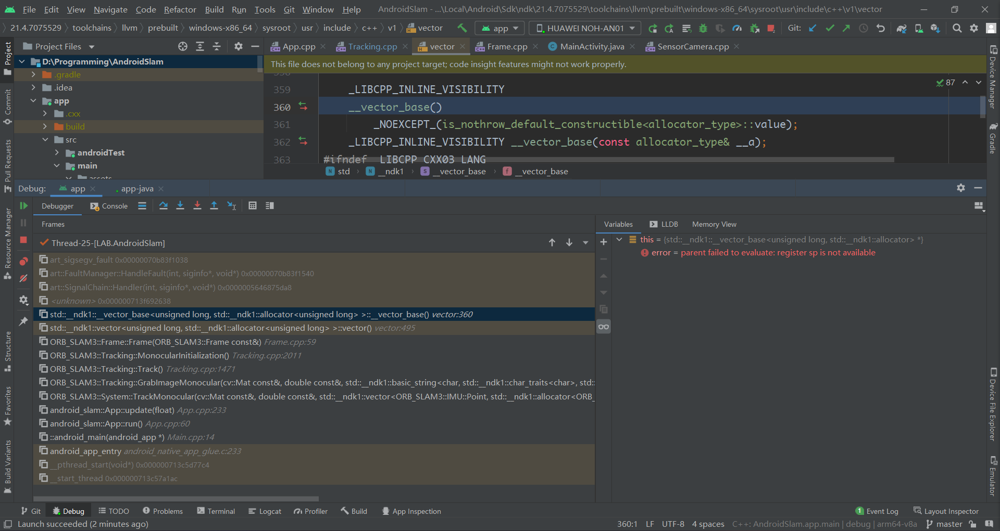

# AndroidSlam
SLAM system on Android.

# 日志
## 2022/09/20
### 1. 项目结构更改
目前的项目结构部分文件如下(app--src--main)  
```
main
  |
  +-assets
  |   |
  |   +-shader        // for GLES.
  |   |
  |   +-vocabulary    // ORB Voc.
  |
  +-cpp
      |
      +-app           // android app codes.
      |
      +-slam          // ORB-SLAM3 and my slam-warpper.
```

ORBVoc.txt文件由于过大被删除，clone项目后需要将vocabulary文件夹下的ORBVoc.zip解压。

### 2. ORB-SLAM3修改
在之前的程序中，出现sp寄存器无法读取的错误，截图如下：  



目前的修改方案为：
```
1. 删除ORB-SLAM3::Frame类的拷贝构造函数，并将其默认拷贝构造和默认拷贝赋值函数设为私有
2. 为ORB-SLAM3::Frame类引入copyFrom()函数，用于原地复制
3. 为ORB-SLAM3::Frame类引入template<> reset()函数，用于原地重新构造
4. 更改ORB-SLAM3中所有调用了拷贝构造和拷贝赋值的地方为copyFrom()
```